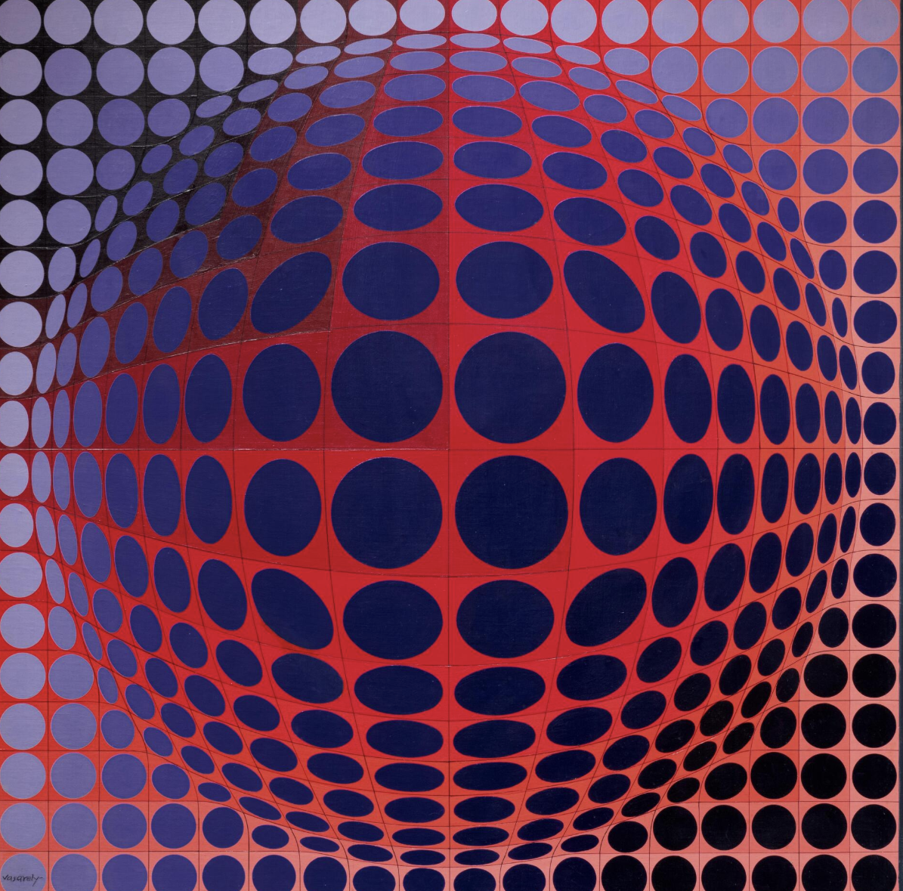
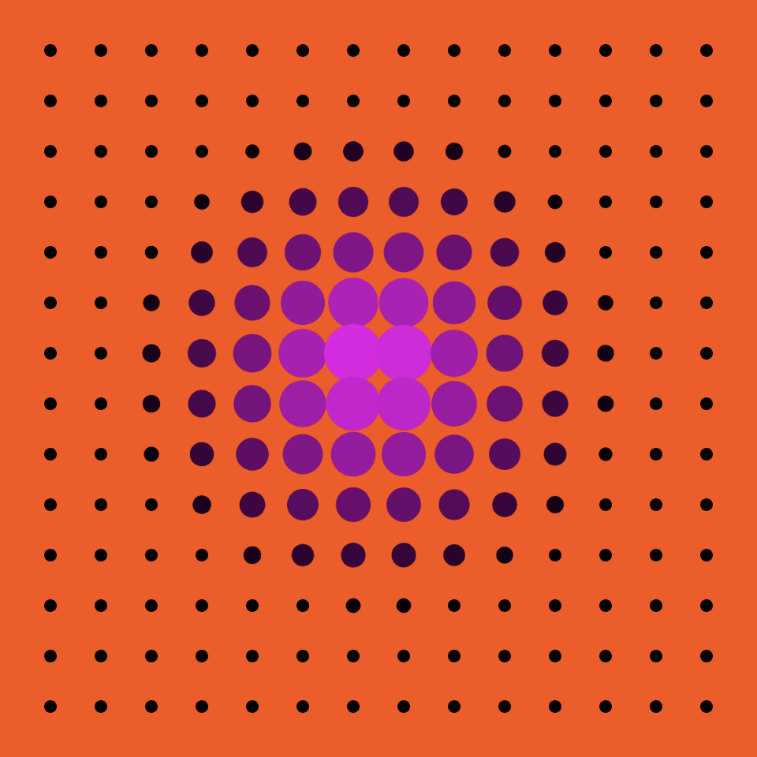
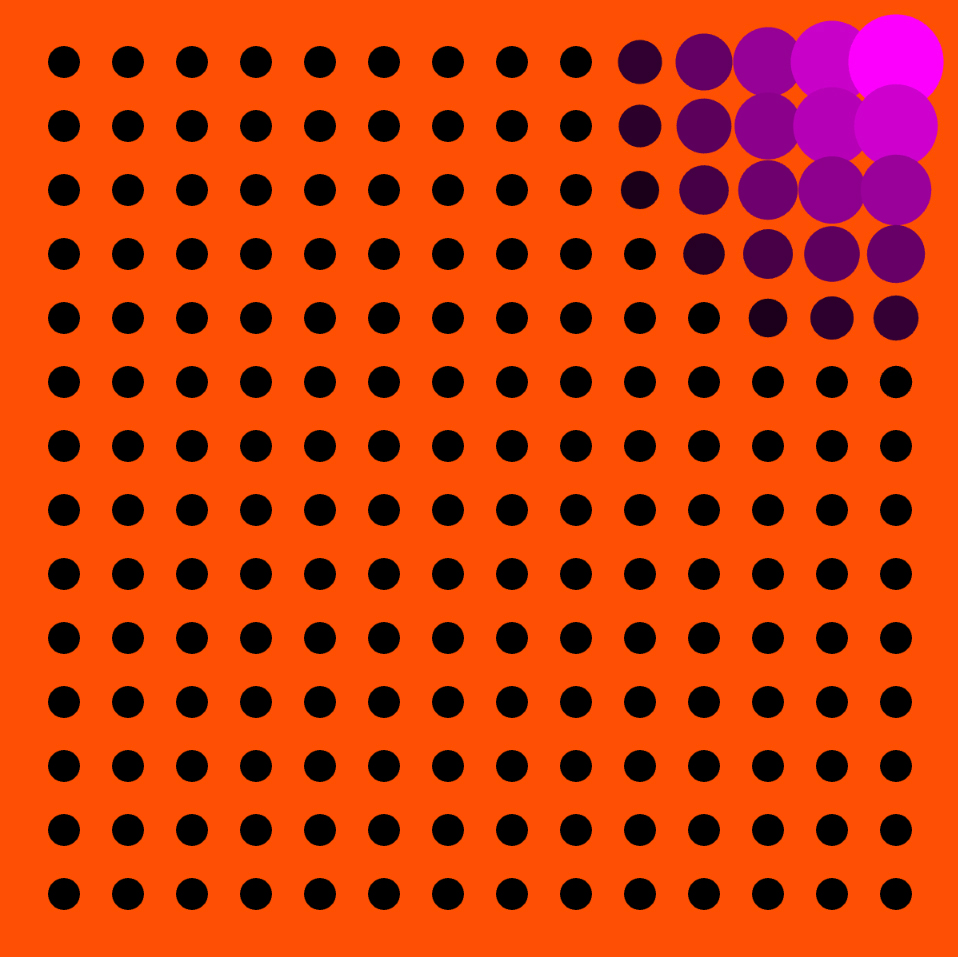
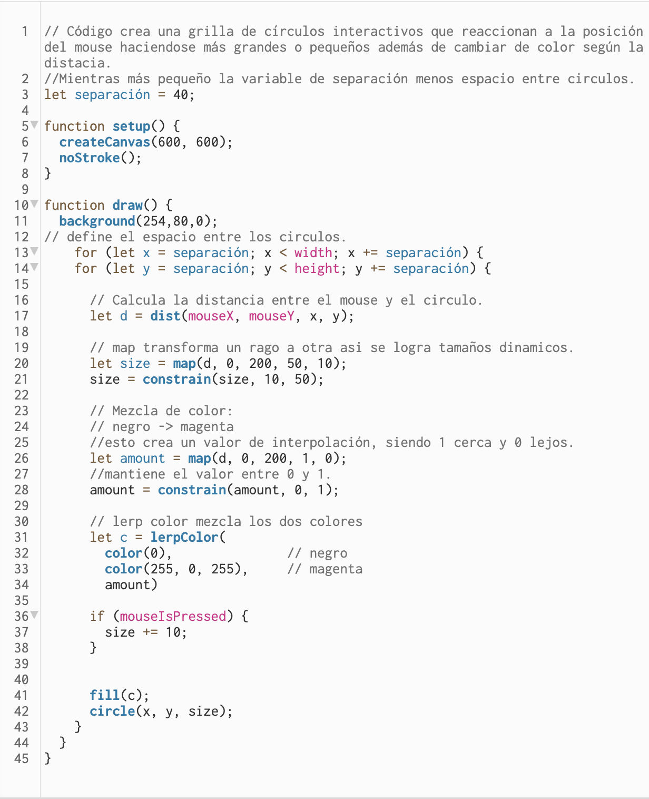
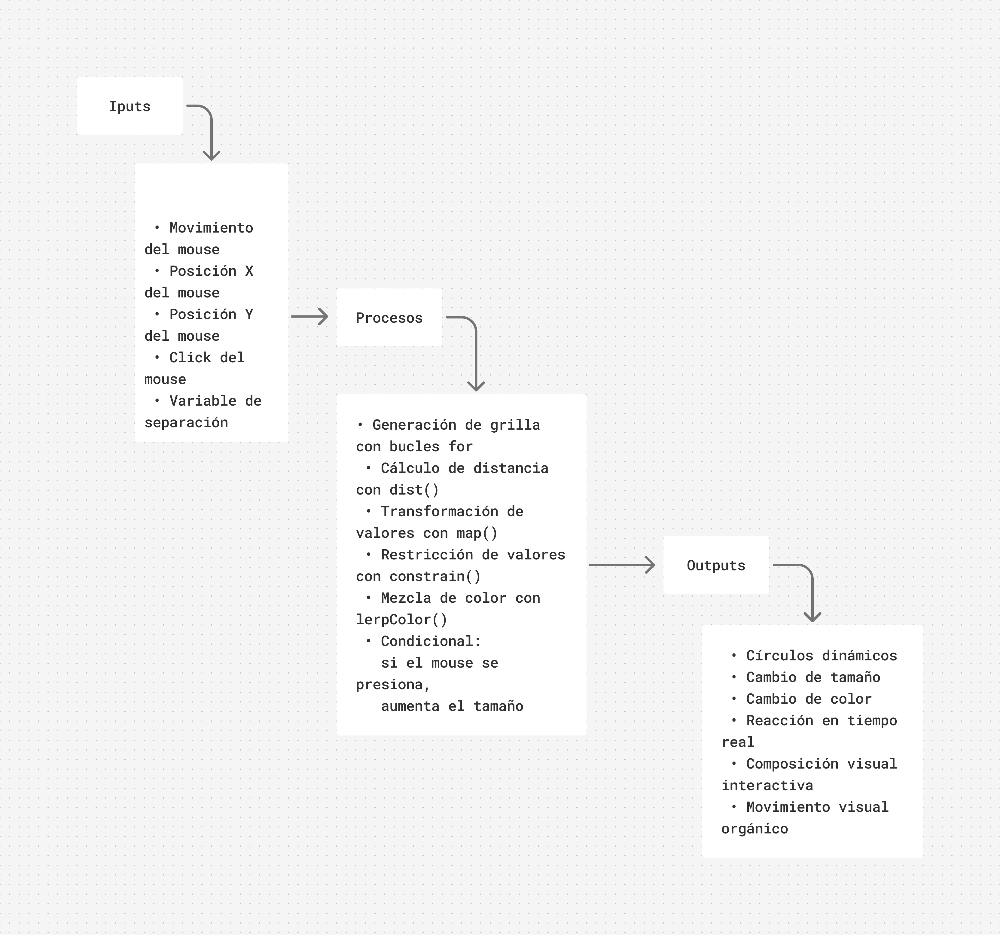

# Entrega-de-Solemne-02

**Información del proyecto**

Este proyecto está inspirado en **Victor Vasarely**, el llegó a ser uno de los líderes del Arte Óptico en Europa. Abandonó los estudios de medicina a los veinte años para dedicarse al arte. Se trasladó a París, donde tuvo bastante éxito como diseñador gráfico en publicidad antes de entregarse a la pintura. 
Si bien no es tan parecido esta es la obra en la cual me guié.

**"Agev" (1974)**

*acrílico sobre lienzo
80,6 x 80,6 cm.
Ejecutado en 1974.*

**Mi trabajo**

 

**Descripción Objetiva**

Este código genera una grilla de círculos interactivos que reaccionan al movimiento del mouse. A través de dos bucles for, se dibujan múltiples círculos distribuidos por toda la pantalla según la variable separación, donde mientras más pequeño es el valor, más juntos aparecen los círculos. El programa calcula constantemente la distancia entre el mouse y cada círculo usando dist(), y con la función map() transforma esa distancia en distintos tamaños y colores: cuando el cursor está cerca, los círculos se vuelven más grandes y oscuros, y cuando está lejos se hacen más pequeños y toman un color magenta. Además, con lerpColor() se mezclan gradualmente ambos colores para crear una transición más suave y dinámica. Finalmente, si se presiona el mouse, los círculos aumentan aún más de tamaño, haciendo que la interacción sea más evidente y reactiva en tiempo real.

**Descripción Conceptual**

La pieza busca generar una sensación de movimiento y transformación continua a partir de elementos simples y repetitivos, creando una experiencia visual interactiva donde el usuario influye directamente en el comportamiento de la composición.

**Código**

[Link a p5.js](https://editor.p5js.org/antonia.rivera7/sketches/_soccj-_p)

**Input y Output del sistema**

[Link a Figma](https://www.figma.com/board/Fi36u0dazhWP3UQwJ2pKki/Te-damos-la-bienvenida-a-FigJam?node-id=0-1&t=ILlLIJpSHexL8kpF-1)

